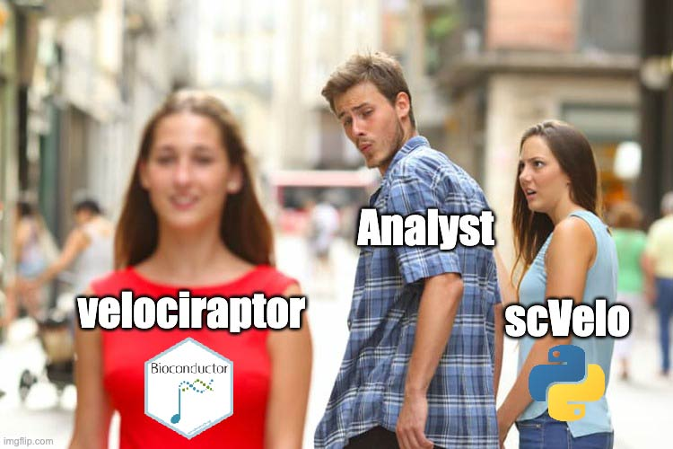

layout: true

<div class="my-header"></div>

<div class="my-footer"><span>
Kevin Rue-Albrecht
&emsp;&emsp;&emsp;&emsp;&emsp;&emsp;&emsp;&emsp;&emsp;&emsp;&emsp;&emsp;&emsp;&emsp;&emsp;&emsp;
velociraptor
</span></div>

```{r setup, include=FALSE}
stopifnot(require(htmltools))
stopifnot(require(RefManageR))
stopifnot(require(knitr))
```

```{r htmltools, include=FALSE}
stopifnot(requireNamespace("htmltools"))
htmltools::tagList(rmarkdown::html_dependency_font_awesome())
```

```{r, load_refs, include=FALSE, cache=FALSE}
options(htmltools.dir.version = FALSE)
BibOptions(
  check.entries = FALSE,
  bib.style = "authoryear",
  cite.style = "authoryear",
  max.names = 1,
  style = "markdown",
  hyperlink = "to.doc",
  dashed = TRUE,
  longnamesfirst = FALSE)
bib <- ReadBib("references.bib")
NoCite(bib, "orchestrating2015")
```

```{r, echo=FALSE}
suppressPackageStartupMessages({
  library(scater)
  library(scuttle)
  library(scran)
  library(scRNAseq)
  library(velociraptor)
  library(ggplot2)
  library(SingleCellExperiment)
  library(SummarizedExperiment)
  library(patchwork)
})
```

---

# RNA velocity predicts the future state of cells

```{r, echo=FALSE}
knitr::include_graphics("img/lamanno2018_fig3.png")
```

.right[
.small-p[
RNA velocity field describes fate decisions of major neural lineages in the hippocampus.
`r Citep(bib, "lamanno2018")`
]
]

---

# RNA velocity from spliced and unspliced mRNAs

```{r, echo=FALSE}
knitr::include_graphics("img/lamanno2018_fig1.png")
```

.right[
.small-p[
Balance between unspliced and spliced mRNAs is predictive of cellular state progression.
`r Citep(bib, "lamanno2018")`
]
]

---

# scVelo

* Python package: [Read the Docs](https://scvelo.readthedocs.io/).
* Estimates RNA velocity from estimates of gene-wise spliced and unspliced abundances.
* Steady-state, stochastic, dynamic models.
* Uses the `AnnData` class for internal data representation: [Read the Docs](https://anndata.readthedocs.io/en/latest/)
* Not straightforward to integrate in an R/Bioconductor-based workflow.

.right[
.small-p[
Balance between unspliced and spliced mRNAs is predictive of cellular state progression.
`r Citep(bib, "bergen2020")`
]
]

---

# The Bioconductor factor

```{r, echo=FALSE}

```

---

#  is a Bioconductor-friendly wrapper of <i class="fab fa-python"></i> scVelo

 `r BiocStyle::Biocpkg('velociraptor')`
uses
 `r BiocStyle::Biocpkg('basilisk')`
to run <i class="fab fa-python"></i> [scVelo](https://pypi.org/project/scvelo/)
in a `BasiliskEnvironment`
(i.e., a  [Conda](https://docs.conda.io/en/latest/) environment).

```{r, eval=FALSE}
setMethod("scvelo", "SummarizedExperiment", function(x, ...,
    assay.X="counts", assay.spliced="spliced", assay.unspliced="unspliced")
{
  ...
  output <- basiliskRun(env = velo.env, fun = .run_scvelo,
      X = X, spliced = spliced, unspliced = unspliced,
      use.theirs = use.theirs, mode = mode,
      scvelo.params = scvelo.params,
      dimred = dimred)
  ...
}
```

`velociraptor::scvelo()` returns a `SingleCellExperiment` object containing the output of the velocity calculations.

---

# Input and data representation

* The input to `scVelo` is two gene x cell count matrices, tabulating the UMI count for spliced and unspliced variants of each gene.
* Several tools exist to estimate these counts from the raw reads (see `r Citet(bib, "soneson2021")` for an overview).
* Count matrices are stored as assays in a `SummarizedExperiment` object.
* The `r BiocStyle::Biocpkg('zellkonverter')` package takes care of conversion between the `SummarizedExperiment` and `AnnData` formats. 

```{r, echo=FALSE, message=FALSE, warning=FALSE}
hermann <- scRNAseq::HermannSpermatogenesisData()
hermann <- hermann[, hermann$celltype %in% c("Early Round spermatids",
                                             "Late Round spermatids",
                                             "Mid Round spermatids")]
hermann$celltype <- factor(hermann$celltype, 
                           levels = c("Early Round spermatids",
                                      "Mid Round spermatids",
                                      "Late Round spermatids"))
set.seed(100)
hermann <- scuttle::logNormCounts(hermann, assay.type = 1)
dec <- scran::modelGeneVar(hermann)
top.hvgs <- scran::getTopHVGs(dec, n = 2000)
hermann <- scater::runPCA(hermann, subset_row = top.hvgs)
hermann <- scater::runTSNE(hermann, dimred = "PCA")
```


```{r, message=FALSE}
hermann
```

---

# Running scvelo()

Use gene selection, normalization and dimension reduction from `scVelo`, or customize each step in R for full compatibility with the rest of the workflow.

```{r, message=FALSE, warning=FALSE}
(hermann_velo <- velociraptor::scvelo(hermann, subset.row = top.hvgs, assay.X = "spliced", use.dimred = "PCA"))
reducedDim(hermann_velo, "TSNE") <- reducedDim(hermann, "TSNE")
hermann_velo$celltype <- hermann$celltype
```

---

# Project velocities onto low-dimensional embedding


```{r, message=FALSE, fig.width=7, fig.height=4, fig.align="center"}
embedded <- embedVelocity(reducedDim(hermann, "TSNE"), hermann_velo)
grid.df <- gridVectors(reducedDim(hermann, "TSNE"), embedded)

plotTSNE(hermann, colour_by="celltype") +
    geom_segment(data = grid.df, mapping = aes(x = start.1, y = start.2, 
        xend = end.1, yend = end.2), arrow = arrow(length = unit(0.05, "inches")))
```

---

# Gene-wise visualizations

```{r, fig.width=12, fig.height=5, fig.align="center"}
plotVelocity(hermann_velo, c("ENSMUSG00000032601.13"), use.dimred = "TSNE", 
             color_by = "celltype")
```

---

# References

.small-p[
```{r refs, include=TRUE, echo=FALSE, results="asis"}
PrintBibliography(bib)
```
]

.center[


]