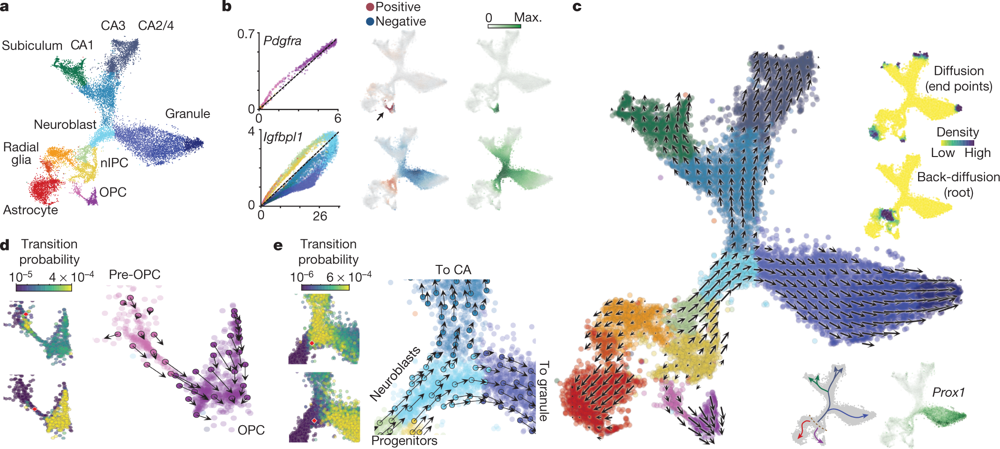
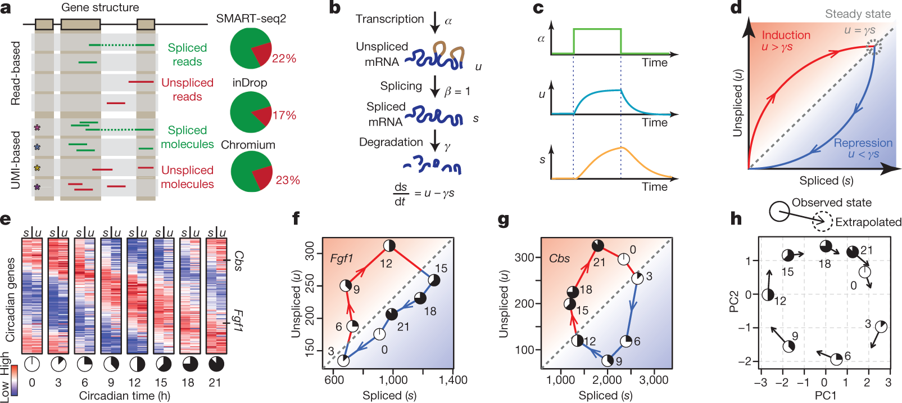

layout: true

<div class="my-header"></div>

<div class="my-footer"><span>
Kevin Rue-Albrecht
&emsp;&emsp;&emsp;&emsp;&emsp;&emsp;&emsp;&emsp;&emsp;&emsp;&emsp;&emsp;&emsp;&emsp;&emsp;&emsp;
velociraptor
</span></div>

```{r setup, include=FALSE}
stopifnot(require(htmltools))
stopifnot(require(RefManageR))
stopifnot(require(knitr))
```

```{r htmltools, include=FALSE}
stopifnot(requireNamespace("htmltools"))
htmltools::tagList(rmarkdown::html_dependency_font_awesome())
```

```{r, load_refs, include=FALSE, cache=FALSE}
options(htmltools.dir.version = FALSE)
BibOptions(
  check.entries = FALSE,
  bib.style = "authoryear",
  cite.style = "authoryear",
  max.names = 2,
  style = "markdown",
  hyperlink = "to.doc",
  dashed = TRUE)
bib <- ReadBib("references.bib")
NoCite(bib, "orchestrating2015")
```

---

# RNA velocity predicts the future state of cells

```{r, echo=FALSE}

```

.right[
.small-p[
RNA velocity field describes fate decisions of major neural lineages in the hippocampus.
`r Citep(bib, "lammano2018")`
]
]

---

# RNA velocity from spliced and unspliced mRNAs

```{r, echo=FALSE}

```

.right[
.small-p[
Balance between unspliced and spliced mRNAs is predictive of cellular state progression.
`r Citep(bib, "lammano2018")`
]
]

---

# The Bioconductor factor

```{r, echo=FALSE}
knitr::include_graphics("img/distracted-analyst.jpg")
```

---

#  is a Bioconductor-friendly wrapper of <i class="fab fa-python"></i> scVelo

 `r BiocStyle::Biocpkg('velociraptor')`
uses
 `r BiocStyle::Biocpkg('basilisk')`
to run <i class="fab fa-python"></i> [scVelo](https://pypi.org/project/scvelo/)
in a `BasiliskEnvironment`
(i.e., a  [Conda](https://docs.conda.io/en/latest/) environment).

```{r, eval=FALSE}
setMethod("scvelo", "SummarizedExperiment", function(x, ...,
    assay.X="counts", assay.spliced="spliced", assay.unspliced="unspliced")
{
  ...
  output <- basiliskRun(env = velo.env, fun = .run_scvelo,
      X = X, spliced = spliced, unspliced = unspliced,
      use.theirs = use.theirs, mode = mode,
      scvelo.params = scvelo.params,
      dimred = dimred)
  ...
}
```

`velociraptor::scvelo()` returns a `SingleCellExperiment` object containing the output of the velocity calculations.

---

# References

.small-p[
```{r refs, include=TRUE, echo=FALSE, results="asis"}
PrintBibliography(bib)
```
]

.center[


]